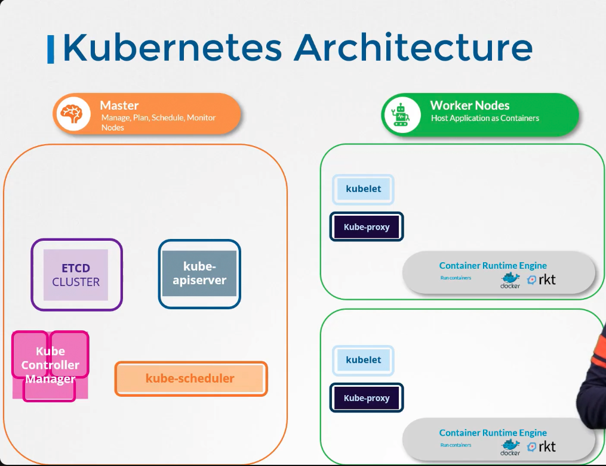
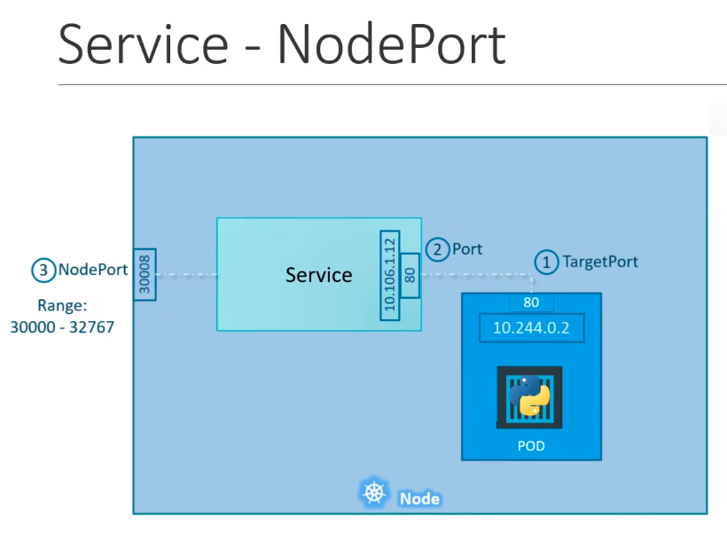
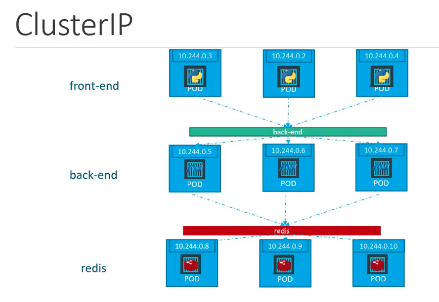
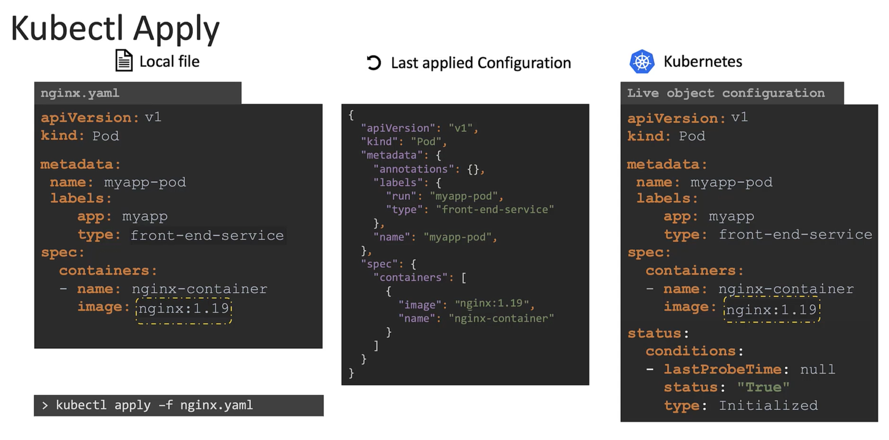
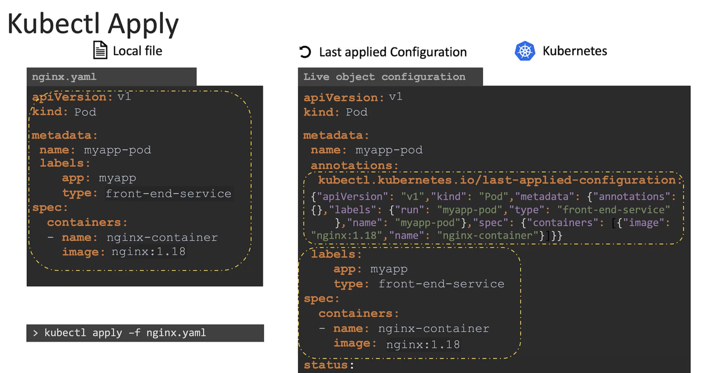

# Certified Kubernetes Administrator - CKA

## 1 - Core Concepts

### - Kubernetes Architecture



A kubernetes cluster is composed of multiple nodes amongst which we have the master and worker nodes
- `Master Node -` The master node is made up of :  
  - ETCD : Whoch key-value pair database whoch store information about the cluster
  - kube-apiserver : Orchestrates all operation within the cluster
  - kube-scheduler : schedules applications or pods on worker nodes
  - kube controller manager : Controls all fonctions like replication controller, node controller

- `Worker node -` On the other hand we have :
  - kubelet : Listens for instructions from the kube-apiserver and manages containers
  - kube-proxy : Enables communications beyween services in the cluster

### - ETCD

ETCD is a distributed reliable key-value store that is simple, secure and fast. </br>

To install ETCD you need to erform 3 actions:

```bash
# 1 - Download the binaries
curl -L https://github.com/etcd-io/etcd/releases/download/v3.5.16/etcd-v3.5.16-linux-amd64.tar.gz -o etcd-v3.5.16-linux-amd64.tar.gz

# 2 - Extract it
tar xvzf etcd-v3.5.16-linux-amd64.tar.gz

# 3 - Run th executable files
cd etcd-v3.5.16-linux-amd64
./etcd
```

ETCD runs by default on port `2379`

In kubernetes ETCD stores information about :
- Nodes
- PODs
- Configs
- Secrets
- Accounts
- Roles
- Bindings etc

#### - ETCD Commands
Additional information about ETCDCTL Utility
</br>ETCDCTL is the CLI tool used to interact with ETCD.ETCDCTL can interact with ETCD Server using 2 API versions – Version 2 and Version 3. By default it’s set to use Version 2. Each version has different sets of commands.

For example, ETCDCTL version 2 supports the following commands:

```bash
etcdctl backup
etcdctl cluster-health
etcdctl mk
etcdctl mkdir
etcdctl set
```

Whereas the commands are different in version 3

```bash
etcdctl snapshot save
etcdctl endpoint health
etcdctl get
etcdctl put
```

To set the right version of API set the environment variable ETCDCTL_API command

```bash
export ETCDCTL_API=3
```

When the API version is not set, it is assumed to be set to version 2. And version 3 commands listed above don’t work. When API version is set to version 3, version 2 commands listed above don’t work.

Apart from that, you must also specify the path to certificate files so that ETCDCTL can authenticate to the ETCD API Server. The certificate files are available in the etcd-master at the following path. We discuss more about certificates in the security section of this course. So don’t worry if this looks complex:

```bash
--cacert /etc/kubernetes/pki/etcd/ca.crt
--cert /etc/kubernetes/pki/etcd/server.crt
--key /etc/kubernetes/pki/etcd/server.key
```
So for the commands, I showed in the previous video to work you must specify the ETCDCTL API version and path to certificate files. Below is the final form:


```bash
kubectl exec etcd-controlplane -n kube-system -- sh -c "ETCDCTL_API=3 etcdctl get / --prefix --keys-only --limit=10 --cacert /etc/kubernetes/pki/etcd/ca.crt --cert /etc/kubernetes/pki/etcd/server.crt --key /etc/kubernetes/pki/etcd/server.key"
```

### ReplicaSet and Replication Controller
A replication controller ensures that nomber of pods is always runnig for a given Pod template. It is the old way of representing the replication. As of now the new way of ensuring the replication of Pods is the implementation of ReplicaSet

```yaml
# rc-definition.yaml
apiVersion: v1
kind: ReplicationController
metadata:
  name: myapp-rc
  labels:
    app: myapp
    type: front-end

spec:
  replicas: 3
  template:
    metadata:
      name: myapp-pod
      labels:
        app: myapp
        type: front-end
    spec:
      containers:
      - name: nginx-container
        image: nginx

# kubectl create -f rc-definition.yaml
```
The ReplicaSet works on the same basis as the ReplicationController, the sole difference between them is tha in the ReplicaSetwe have `selector:` which makes the matching of the labels between the ReplicaSet and the Pods it is monitoring.
```yaml
# rs-definition.yaml
apiVersion: apps/v1
kind: ReplicaSet
metadata:
  name: myapp-replicaset
  labels:
    app: myapp
    type: front-end

spec:
  replicas: 3
  template:
    metadata:
      name: myapp-pod
      labels:
        app: myapp
        type: front-end
    spec:
      containers:
      - name: nginx-container
        image: nginx
  selector:
    matchLabels:
      type: front-end

# kubectl create -f rs-definition.yaml
```

Useful commands for managing replicaset:
```bash
# request infos about ReplicaSet declaration in the manifest
kubectl explain replicaset

# Create new replicaset from declarative manifest
kubectl create -f rs-definition.yaml

# get all replicaset in the current namespace and context
kubectl get replicaset

# delete replicaset
kubectl delete replicaset myapp-rs

# edit replicatset using manifest file
kubectl replace -f rs-definition.yaml

# scale the replicaset to the desired number of pods
kubectl scale --replicas=6 -f rs-definition.yaml
```

---
##### Exam Tips

As you might have seen already, creating and editing YAML files is a bit difficult, especially in the CLI. During the exam, you might find it difficult to copy and paste YAML files from the browser to the terminal. Using the kubectl run command can help in generating a YAML template. And sometimes, you can even get away with just the kubectl run command without having to create a YAML file at all. For example, if you were asked to create a pod or deployment with a specific name and image, you can simply run the kubectl run command.

Use the below set of commands and try the previous practice tests again, but this time, try to use the below commands instead of YAML files. Try to use these as much as you can going forward in all exercises.

Reference (Bookmark this page for the exam. It will be very handy):

https://kubernetes.io/docs/reference/kubectl/conventions/

Create an NGINX Pod

```bash
kubectl run nginx --image=nginx
```

Generate POD Manifest YAML file `(-o yaml)`. Don’t create it `(–dry-run)`

```bash
kubectl run nginx --image=nginx --dry-run=client -o yaml
```

Create a deployment

```bash
kubectl create deployment --image=nginx nginx
```

Generate Deployment YAML file `(-o yaml)`. Don’t create it `(–dry-run)`

```bash
kubectl create deployment --image=nginx nginx --dry-run=client -o yaml
```

Generate Deployment YAML file `(-o yaml)`. Don’t create it `(–dry-run)` and save it to a file.

```bash
kubectl create deployment --image=nginx nginx --dry-run=client -o yaml > nginx-deployment.yaml
```

Make necessary changes to the file (for example, adding more replicas) and then create the deployment.

```bash
kubectl create -f nginx-deployment.yaml
```
OR

In k8s version 1.19+, we can specify the `--replicas` option to create a deployment with 4 replicas.

```bash
kubectl create deployment --image=nginx nginx --replicas=4 --dry-run=client -o yaml > nginx-deployment.yaml
```

### Deployments 
The deployment is very similar to the replicaset. The sole differenceis the kind.
When a Deploymentis created, it automatically creates a replicatset which inturn cretaes the Pods

```yaml
# deployment-definition.yaml
apiVersion: apps/v1
kind: Deployment
metadata:
  name: myapp-replicaset
  labels:
    app: myapp
    type: front-end

spec:
  replicas: 3
  template:
    metadata:
      name: myapp-pod
      labels:
        app: myapp
        type: front-end
    spec:
      containers:
      - name: nginx-container
        image: nginx
  selector:
    matchLabels:
      type: front-end

# kubectl create -f deployment-definition.yaml

# to get all the created resources :
# kubectl get all
```

### Services

#### Service - NodePort
Service help cnnect application with other apps and make them available outsite the clusters,



```yaml
# service-definition.yaml
apiVersion: v1
kind: Service
metadata:
  name: myapp-service

spec:
  type: NodePort
  ports:
    - targetPort: 80
      port: 80
      nodePort: 30008
  selector:
    app: myapp
    type: front-end
```

To match POds on a service we need to pull the labels from the port to the selector of the service.

#### Service - ClusterIP



A ClusterIP service is the default type of service when you create a service in the kubernetes cluster. It is used to ensure communication between internal groups of pods 
```yaml
# service-definition.yaml
apiVersion: v1
kind: Service
metadata:
  name: myapp-service

spec:
  type: ClusterIP
  ports:
    - targetPort: 80
      port: 80
      nodePort: 30008
  selector:
    app: myapp
    type: backend
```

#### Service - LoadBalancer

```bash
# Cretae a pod and a service associated to it in one shot
kubectl run httpd --image=httpd:alpine --port=80 --expose=true
```
### Kubectl Apply 
When you use the `kubectl apply -f` to create resource from a local manifest file, there is a copy of the last version of the resource recently created stored in memory. </br>



It is advicable to use `kubectl apply -f` instead of `kubctl create -f`.



ref: https://github.com/kodekloudhub/certified-kubernetes-administrator-course
---
## 2 - Scheduling
The scheduler is responsible for the assigning of pods to nodes
There are two modes of scheduling : `manual` & `automated`

### Manual Scheduling
When you create a pod in the CLuster, check whether or not the scheduler is present and well setup. This in case the pod remains in pending state.

### Labels & Selectors
Labels are assigned to objects when creating them and selectors a re used to retriev the labels based on the match.

```bash
# get all pods in the frontend tier
kubectl get pods -l tier=frontend --no-headers

kubectl get pods --selector tier=frontend --no-headers
```

#### Taints & Tolerations
Taints and tolerations are used to set restrictions on what pods can be scheduled on which node

```bash
# How to taint any node in a cluster : taint-effect = [NoSchedule | PreferNoSchedule | NoExecute]
kubectl taint nodes node-name key=value:taint-effect

# example :
kubectl taint nodes node01 app=blue:NoSchedule

# remove taint from a node
kubectl taint nodes node01 app=blue:NoSchedule-

# to remove a taint from a node you apply the same commnd used to put a taint and add hiphen at the end `-`
```
The taint effect determines what happens to the POD that DO NOT TOLERATE this taint.

Toleration are added to the pods in order to get it scheduled on the tainted node

```yaml
# pod-definition.yaml
apiVersion: v1
kind: Pod
metadata:
  name: myapp-pod
spec:
  containers:
    - name: nginx-container
      image: nginx
  tolerations:
    - key: "app"
      operator: "Equal"
      value: "blue"
      effect: "NoSchedule"
```

### Node Selectors
Node selectors are assigned to PODs in order to bind them on a specific node when scheduling. Before a node selector value can added to the pod definition, the node needs to be labled :

```bash
kubectl label nodes <node-name> <label-key>=<label-value>

```

```yaml
# pod-definition
apiVersion: v1
kind: Pod
metadata:
  name: myapp-pod

spec:
  containers:
    - name: data-processing
      image: data-processing

  nodeSelector:
    size: Large
```

### Node affinity
Node affinity provides advanced capabilities to limit pod placement on nodes

```yaml
# pod-definition
apiVersion: v1
kind: Pod
metadata:
  name: myapp-pod

spec:
  containers:
    - name: data-processing
      image: data-processing

  affinity:
    nodeAffinity:
      requiredDuringSchedulinIgnoredDuringExecution:
        nodeSelectorTerms:
          - matchExpressions:
              - key: size
                operator: In
                values:
                  - Large
```

##### lab - Node, Selectors, Affinity

```bash
# get all labels in a node
kubectl get node node01 -o jsonpath='{.metadata.labels}' | jq

# Get the number of labels on the node01
kubectl get node node01 -o jsonpath='{.metadata.labels}' | jq 'keys | length'

# get the value of the label kubernetes.io/hostname from node01
kubectl get node node01 -o json | jq -r '.metadata.labels["kubernetes.io/hostname"]'

# Count the number of files in the static pods folder excluding folders and hidden files
find /etc/kubernetes/manifests/ -type f ! -name ".*" | wc -l
```

### Resource Requirements
Resources determine the amount of CPU and RAM used by  the containers in a pod.
To specifiy the resources in a pod you add section `resources:` in the `spec:` section of the pod definition file

```yaml
---
apiVersion: v1
kind: Pod
metadata:
  name: frontend
spec:
  containers:
  - name: app
    image: images.my-company.example/app:v4
    resources:
      requests:
        memory: "64Mi"
        cpu: "250m"
      limits:
        memory: "128Mi"
        cpu: "500m"
  - name: log-aggregator
    image: images.my-company.example/log-aggregator:v6
    resources:
      requests:
        memory: "64Mi"
        cpu: "250m"
      limits:
        memory: "128Mi"
        cpu: "500m"
```

It sis possible to set the limit range of resources for cpu and memory at the namespace level, this restricts the limits consumed by pods.

you can extract the pod defintion in YAML format using the command

```bash
kubectl get pod webapp -o yaml > my-new-pod.yaml
```
### DaemonSet
A DaemonSet deploys a copy of the pod in all the nodes of the cluster. It works like a deployment and ReplicaSet.
example : `kube-proxy`

```yaml
apiVersion: apps/v1
kind: DaemonSet
metadata:
  name: fluentd-elasticsearch
  namespace: kube-system
  labels:
    k8s-app: fluentd-logging
spec:
  selector:
    matchLabels:
      name: fluentd-elasticsearch
  template:
    metadata:
      labels:
        name: fluentd-elasticsearch
    spec:
      tolerations:
      # these tolerations are to have the daemonset runnable on control plane nodes
      # remove them if your control plane nodes should not run pods
      - key: node-role.kubernetes.io/control-plane
        operator: Exists
        effect: NoSchedule
      - key: node-role.kubernetes.io/master
        operator: Exists
        effect: NoSchedule
      containers:
      - name: fluentd-elasticsearch
        image: quay.io/fluentd_elasticsearch/fluentd:v2.5.2
        resources:
          limits:
            memory: 200Mi
          requests:
            cpu: 100m
            memory: 200Mi
        volumeMounts:
        - name: varlog
          mountPath: /var/log
      # it may be desirable to set a high priority class to ensure that a DaemonSet Pod
      # preempts running Pods
      # priorityClassName: important
      terminationGracePeriodSeconds: 30
      volumes:
      - name: varlog
        hostPath:
          path: /var/log

```

The easiest way to deploy a DaemonSet is to `--dry-run` the creation of a Deployment then changindg the kind from Deployment to DaemonSet. After what delete the `strategy`, `reousrce`, `replicas`

### Static Pods
Static pods definition files are stored by default in the folder `/etc/kubernetes/manifests`. They pods created by the kubelet daemon. This folder could be any folder on the system, the folder should be set in the `kubelet.service` definition as `--pod-manifest-path=/etc/kubernetes/manifests` variable. To check this you should inpect the kubelet service `ps aux | grep kubelet`, the search for the variable `--config`. </br>

You could also define a varibale `--config=kubeconfig.yaml` in the kubelet.service the inside the `kubeconfig.yaml` set the variable `staticPodPath: /etc/kubernetes/manifests` or to any folder you want to use as directory to store the static pod definition files.</br>

To view the static pods, use the command: `docker ps`

```bash
# run a pod with command arguments
kubectl run static-busybox --image busybox --dry-run=client -o yaml > busy.yaml -- sleep 1000

kubectl run static-busybox --image busybox --dry-run=client -o yaml > busy.yaml --command -- sleep 1000
```

- ps : To verify if a pod is static or not you can check the pod definition from the running instance and check the owner section. If the owner is a Node then it is a Static pod.

### Multiple Schedulers

### Scheduler Profiles


##### Ref:

  - https://github.com/kubernetes/community/blob/master/contributors/devel/sig-scheduling/scheduling_code_hierarchy_overview.md

  - https://kubernetes.io/blog/2017/03/advanced-scheduling-in-kubernetes/

  - https://jvns.ca/blog/2017/07/27/how-does-the-kubernetes-scheduler-work/

  - https://stackoverflow.com/questions/28857993/how-does-kubernetes-scheduler-work

  ---
## 3 - Logging And Monitoring
  
### Monitoring Cluster Components
Kubernetes doesn't have a highly performant metrics management system, it instead has metrics-server inbuilt which collects metrics and aggregates them in-memory with the help of `cAdvisor` from the kubelet. </br>

In minikube you can run the command `minikube addons enable metrics-server` to activate the metrics server in your local minikube cluster.


```bash
# view the performance metrics (cpu and memory consumption of nodes)
kubectl top node

# View the performance metrics of the pods in a current namespace
kubectl top pod
```

### Managing Application Logs
To view the logs in kubernetes you do `kubectl logs -f <pod-name> [<contianer-name>]`.
if you have only one container in a pod you view the logs in the following way:

```bash
# get logs of a pod containing a single container
kubectl logs -f pod-name
```

When a pod has multiple containers we view the logs by specifying the container name:

```bash
kubectl logs -f pod-name container-name
```
---
## 4 - Application Lifecycle management

### Application Commands

In containers when passing commands you can either use the `CMD` or `ENTRYPOINT` or both. The difference between the two relies on the fact that ``ENTRYPOINT`` is the default command that runs at startup and ``CMD`` can either be a command that runs at startup if it is used alone in the ``Dockerfile``, it can be over written at the run time when specifying the new commandd to run.

```dockerfile
FROM ubuntu

# Command run by default at startup
ENTRYPOINT ["sleep"]

# Default parameter of the command
CMD ["5"]
```

In a kubernetes pod definition file we have the following equivalence :
  - `command:` == `ENTRYPOINT`
  - `args:` == `CMD`

### ConfigMaps in Kubernetes
Environment variables can be passed to pods via the section ``env:``, `envFrom:`, `volumes:` in the container section of the Pod definition file.

### Secrets
A Secret is an object that contains a small amount of sensitive data such as a password, a token, or a key. Such information might otherwise be put in a Pod specification or in a container image. Using a Secret means that you don't need to include confidential data in your application code.

Because Secrets can be created independently of the Pods that use them, there is less risk of the Secret (and its data) being exposed during the workflow of creating, viewing, and editing Pods. Kubernetes, and applications that run in your cluster, can also take additional precautions with Secrets, such as avoiding writing sensitive data to nonvolatile storage.

Secrets are similar to ConfigMaps but are specifically intended to hold confidential data.

```yaml
apiVersion: v1
data:
  DB_HOST: c3FsMDE=
  DB_PASSWORD: cGFzc3dvcmQxMjM=
  DB_USER: dXNlcjAx
kind: Secret
metadata:
  creationTimestamp: null
  name: db-secret
```

```yaml
apiVersion: v1
kind: Pod
metadata:
  name: myapp-db
spec:
  containers:
  - name: mysql-db
    image: mysql:8.0.40
    env:
      secretRef:      

```

### Encrypting Data at Rest

### Multi Container Pods

### Init Containers

In a `multi-container` pod, each container is expected to run a process that stays alive as long as the POD's lifecycle.

For example in the `multi-container` pod that we talked about earlier that has a web application and logging agent, both the containers are expected to stay alive at all times.

The process running in the log agent container is expected to stay alive as long as the web application is running. If any of them fail, the POD restarts.

But at times you may want to run a process that runs to completion in a container. For example, a process that pulls a code or binary from a repository that will be used by the main web application.

That is a task that will be run only one time when the pod is first created. Or a process that waits for an external service or database to be up before the actual application starts.

That's where `initContainers` comes in. An `initContainer` is configured in a pod-like all other containers, except that it is specified inside a `initContainers` section, like this:

```yaml
apiVersion: v1
kind: Pod
metadata:
  name: myapp-pod
  labels:
    app: myapp
spec:
  containers:
  - name: myapp-container
    image: busybox:1.28
    command: ['sh', '-c', 'echo The app is running! && sleep 3600']
  initContainers:
  - name: init-myservice
    image: busybox
    command: ['sh', '-c', 'git clone  ;']
```
When a POD is first created the `initContainer` is run, and the process in the `initContainer` must run to a completion before the real container hosting the application starts.

You can configure multiple such `initContainers` as well, like how we did for `multi-containers` pod. In that case, each init container is run one at a time in sequential order.

If any of the `initContainers` fail to complete, Kubernetes restarts the Pod repeatedly until the Init Container succeeds. 

```yaml
apiVersion: v1 
kind: Pod 
metadata: 
  name: myapp-pod 
  labels: 
    app: myapp 
spec: 
  containers:
  - name: myapp-container 
    image: busybox:1.28 
    command: ['sh', '-c', 'echo The app is running! && sleep 3600'] 
  initContainers:
  - name: init-myservice 
    image: busybox:1.28 
    command: ['sh', '-c', 'until nslookup myservice; do echo waiting for myservice; sleep 2; done;']
  - name: init-mydb 
    image: busybox:1.28 
    command: ['sh', '-c', 'until nslookup mydb; do echo waiting for mydb; sleep 2; done;']
```
```bash
# get then logs of the init container in the orange pods
k logs orange -c init-myservice
```
Read more about initContainers here. And try out the upcoming practice test.

## 5 - Cluster Maintenance

### OS Upgrades
When performing OS upgrade in a cluster you need to follow the steps below in order to have a coherent state of your cluster after you have finished the upgrade.

For example if you want to upgrade a node-01 let's say : 

```bash
# make the node unscedulable 
kubectl drain node-01

kubectl cordon node-01

# operate the OS upgrade then
kubectl uncordon node-01 
```

### Kubernetes Software Version

