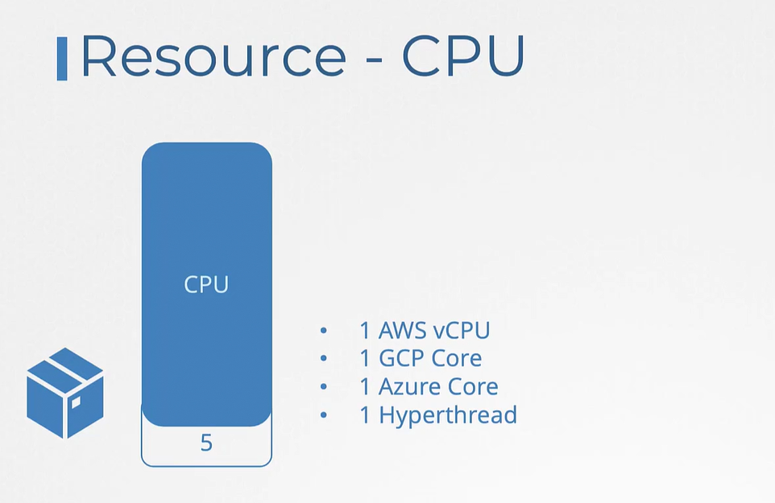
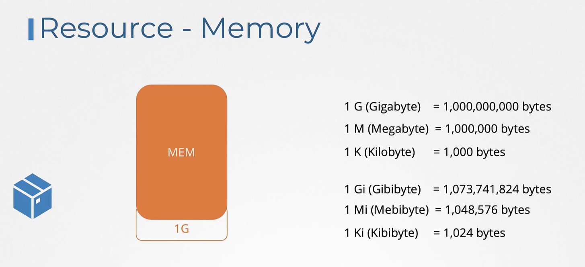

# Certified Kubernetes Applciation Developer ( CKAD ) Study Notes

## 1 - Core Concepts
#### Docker vs ContainerD
- `imagespec` : SPecifications on how an image should be build
- `runtimespec` : specifications on how a container should be build.
- `dockershim` : Hacky way to support Docker outside the CRI
- `containerd` : containerD is an industry standard CRI which can now be installed as a standalone. It come with a command line tool called `ctr` specifically based for debugging in PROD.

- `nerdctl` : 
- `crictl` : Provides CLI for CRI compatible runtimes, it is developped and maintained by the kubernetes community. It is used to inspect and debug containers. It can be installed seperately. It is compatible with mostly all docker commands.

### Creating PODS using YAML definition file
```yaml
# pod-definition.yml

apiVersion: v1
kind: Pod
metadata:
  name: myapp-pod
  labels:
    app: myapp
    type: frontend

spec:
  containers:
    - image: nginx
      name: nginx-controller


```

### Replication Conttrollers

The replication controller ensures that a specified number of pods is running all the time.

```yml
rc-definition.yml
apiversion: v1
kind: ReplicationController
metatdata: 
  name: myapp-rc
  labels:
    app: myapp
    type: front-end
spec:
  replicas: 3
  template:
    metadata:
      name: myapp-pod
      labels:
        app: myapp
        type: frontend
    spec:
      containers:
        - image: nginx
          name: nginx-controller
# kubectl create -f rc-definition.yml
# kubectl get replicationcontroller
    
```

### ReplicaSet
```yml
# replicaset-definition.yml
apiversion: apps/v1
kind: ReplicaSet
metatdata: 
  name: myapp-replicaset
  labels:
    app: myapp
    type: front-end
spec:
  selector:
    matchLabels:
      type: front-end
  replicas: 3
  template:
    metadata:
      name: myapp-pod
      labels:
        app: myapp
        type: frontend
    spec:
      containers:
        - image: nginx
          name: nginx-controller

# kubectl explain replicaset : get informationa about how to setup a replicaset
# kubectl create -f replicaset-definition.yml
# kubectl get replicaset
# kubectl replace -f replicaset-definition.yml
# kubectl replace --replicas=6 -f replcaset-definition.yml
# kubectl scale rs --replicas=6 myapp-replicaset
```

### Deployments
```yml
apiVersion:
kind: Deployment
metadata:
  name:
  labels:

spec:
  
```

### Namespaces

```sh
kubectl create namespace dev
```
```sh
#  Set current context to `dev` namespace.
kubectl config set-context $(kubectl config current-context) --namespace=dev
```
```bash
# get pods in all namespaces
kubectl get pods --all-namespaces 
```

```yaml
# compute-quota.yml
apiversion: v1
kind: ResourceQuota
metadata:
  name: compute-quota
  namespace: dev
spec:
  hard:
    pods: "10"
    requests.cpu: "4"
    requests.memory: 5Gi
    limits.cpu: "10"
    limits.memory: 10Gi
# kubectl create -f compute-quota.yml
```
### Tips :  Imperative Commands
```yaml
kubectl run nginx --image=nginx

kubectl run nginx --image=nginx --dry-run=client -o yaml

kubectl create deployment --image=nginx nginx

`kubectl create deployment --image=nginx nginx --dry-run -o yaml`

kubectl create deployment nginx --image=nginx --replicas=4

kubectl scale deployment nginx --replicas=4

kubectl create deployment nginx --image=nginx--dry-run=client -o yaml > nginx-deployment.yaml

kubectl expose pod redis --port=6379 --name redis-service --dry-run=client -o yaml

kubectl create service clusterip redis --tcp=6379:6379 --dry-run=client -o yaml

kubectl expose pod nginx --port=80 --name nginx-service --type=NodePort --dry-run=client -o yaml

kubectl create service nodeport nginx --tcp=80:80 --node-port=30080 --dry-run=client -o yaml


```

### Certification Tip: Formatting Output with kubectl
```yaml
kubectl create namespace test-123 --dry-run -o json

kubectl create namespace test-123 --dry-run -o yaml

kubectl get pods -o wide

Here are some of the commonly used formats:

-o json : Output a JSON formatted API object.
-o name : Print only the resource name and nothing else.
-o wide : Output in the plain-text format with any additional information.
-o yaml : Output a YAML formatted API object.


```
## 2 - Configuration
### Define, build and modify container images
```Dockerfile
#Dockerfile
FROM Ubuntu

RUN apt-get update && apt-get install python

RUN pip install flask && pip install flask-mysql

COPY . /opt/source-code

ENTRYPOINT FLASK_APP=/opt/source-code/app.py flask run

# docker build Dockerfile -t fryker/my-custom-app
# docker push fryker/my-custom-app
# docker history fryker/my-custom-app
```

### Commands and Arguments In Docker
```Dockerfile
FROM Ubuntu

# default program that runs when the container starts
ENTRYPOINT ["sleep"] 

# deafualt arguments that are passed to the propgram if no external args are specified
CMD ["5"]
```

```yaml
apiVersion: v1
kind: Pod
metadata:
  name: ubuntu-sleeper

spec:
  containers:
    - name: ubuntu-sleeper
      image: ubuntu-sleeper
      command: ["sleep2.0"] # overriding the ENTRYPOINT from Dockerfile
      args: ["10"] # Overiding the CMD from Dockerfile definition file
```

### ConfigMaps
`kubectl create configmap app-config --from-literal=APP_COLOR=blue --from-literal=APP_MOD=prod`

```yaml
# config-map.yaml
apiVersion: v1
kind: ConfigMap
metadata:
  name: app-config
data:
  APP_COLOR: blue
  APP_MODE: prod
```

```yaml
apiVersion: v1
kind: Pod
metadata:
  name: simple-webapp-color
  labels:
    name: simple-webapp-color
spec:
  containers:
  - name: simple-webapp-color
    image: simple-webapp-color
    ports:
      - containerPort: 8080
    envFrom:
      - configMapRef:
          name: app-config
```

### Kubernetes Secrets

To inject a secret in a pod you need to add an env variable.
with the created secret.

```yaml
#secret-data.yml
apiVersion: v1
kind: Secret
metadata:
  name: app-secret
data:
  DB_HOST: MTkyLjE2OC41Ni4xMDA=
  DB_USER: cm9vdA==
  DB_PASSWORD: MTkyLjE2OC41Ni4xMDA=
```

```yaml
# pod-defition.yaml
apiVersion: v1
kind: Pod
metadata:
  name: simple-webapp-color
  labels:
    name: simple-webapp-color
spec:
  containers:
    - name: simple-webapp-color
      image: simple-webapp-color
      ports:
        - containerPort: 8080
      envFrom:
        - secretRef:
            name: app-secret
```

### Resource Requirements
To specify the resources needed by a pod we need to add a `resources` section.
```yaml
# pod-defition.yaml
apiVersion: v1
kind: Pod
metadata:
  name: simple-webapp-color
  labels:
    name: simple-webapp-color
spec:
  containers:
    - name: simple-webapp-color
      image: simple-webapp-color
      ports:
        - containerPort: 8080
      resources:
        requests:
          memory: "1Gi"
          cpu: 1
        limits:
          memory: "2Gi"
          cpu: 2
```
A container can not use  resources beyond the set limits. By defult k8s does not have a resources limits set on pods. The best way to schedule is setting cpu requests without limits.

- resource cpu :


- resource memory :


- We can set the default behaviour of our cluster on the allocation of resources by specifying limit ranges. This is applicable at the namespace level

```yaml
#limit-range-cpu.yaml
apiVersion: v1
kind: LimitRange
metadata:
  name: cpu-resource-constraints
spec:
  limits:
  - default:
      cpu: 500m
    defaultRequest:
      cpu: 500m
    max:
      cpu: "1"
    min:
      cpu: 100m
    type: Container
```

```yaml
#limit-range-memory.yaml
apiVersion: v1
kind: LimitRange
metadata:
  name: memory-resource-constraints
spec:
  limits:
  - default:
      memory: 1Gi
    defaultRequest:
      memory: 1Gi
    max:
      memory: 1Gi
    min:
      memory: 500Mi
    type: Container
```
### Service Accounts
There are two type of accounts in kubernetes:
 
 - User Account :  USed by humans (admin, developer)
 - Service Account : Used by applications (Jenkins, Prometheus, Argo)
 
 When you create a Service Account, a secret token object is also created and associated to it directly and this token is used to authenticate external application which will perform actions on the cluster based on the RBAC policy attached to this Service Account. By default in the k8s cluster there is a Service Account which is mounted on each and every pod created. but the default behaviour can be changed.

 ```bash
 #create a service account
 kubectl create serviceaccount dashboard-sa
 
 # get all service accounts
 kubectl get serviceaccount

# decode a tokenusing jq
 jq -R 'split(".") | select(length > 0) | .[0],.[1] | @base64 | fromjson' <<< tokenashIUWHEwedaduih34q923485.....
 ```

 By default in the recent kubernetes version when you create a service account it is not associated with a token, if you want to create a token and attach it to a service account , use the tempate below:
 ```yaml
 apiVersion: v1
 kind: Secret
 type: kubernetes.io/service-account-token
 metadata:
   name: jenkins-secret
   annotations:
     kubernetes.io/service-account.name: jenkins-sa
 ``` 
## 3 - Multi-Container Pods

## 4 - Observability 

## 5 - Pod Design

## 6 - Services & Networking

## 7 - State Persistence 

## 8 - Security

## 9 - Helm Fundamentals

## 10 - Addition Practice - Kubernetes Challenge (Optional)